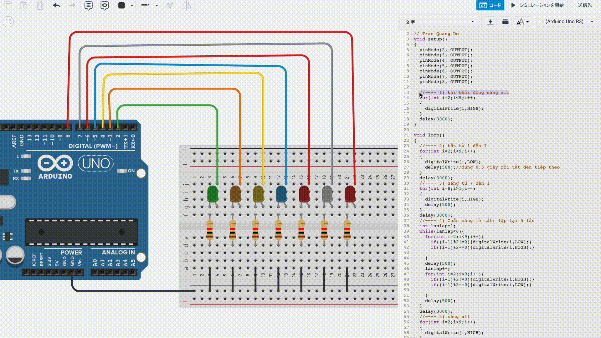

# iot-arduino-led-sample 🐳

## reference
[youtube](https://youtu.be/HF4ks2c2LV8)

## simulator
[tinkercard](https://www.tinkercad.com/things/2pNqepVE2Jn?sharecode=Kq2LLRi3I9v8zFWgPUxuixixP-N8IsBFTWBN5Vt8uac)

## run docker

1. ### src code
    - in `spectacular_crift1.ino` (C++)
